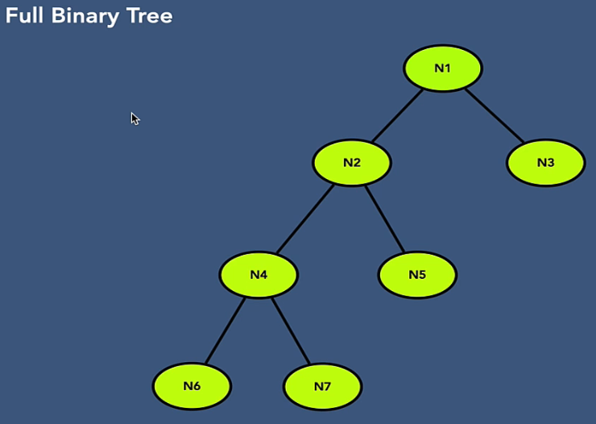
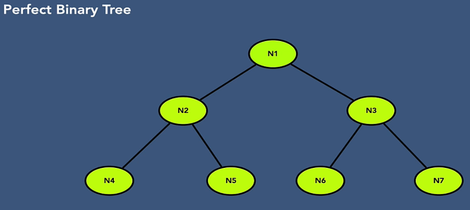
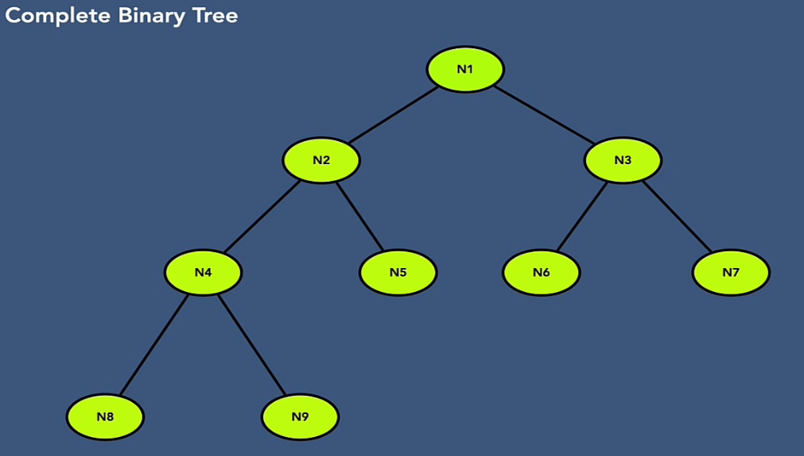
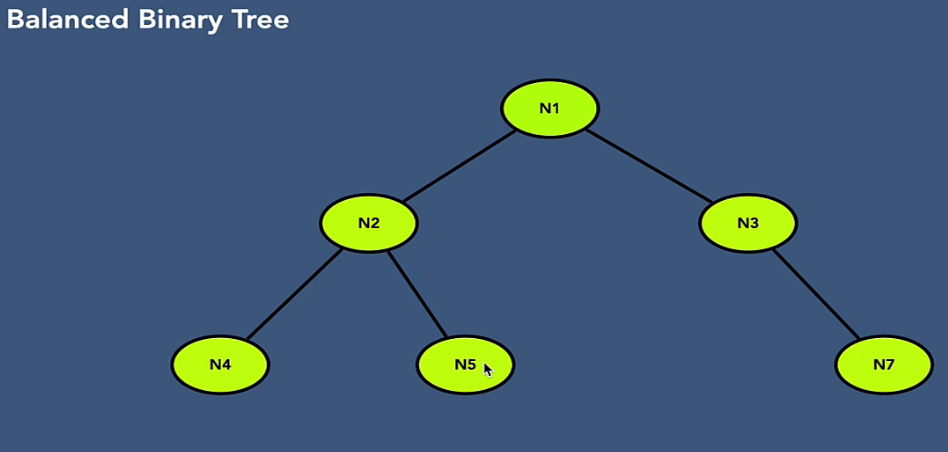

#### Types of Binary Tree:

        - Full Binary Tree
            - a node can have 0 or 2 childrens

        - Perfect Binary Tree
            - all non-leaf nodes should have 2 childrens and 
            - nodes on the same level should have same depth

        - Complete Binary Tree
            - all levels are completely(i.e. 2 children) filled except last level
            - the last level has keys as left as possible.
            e.g :( 
                - if we have children for right node but 
                - don't have any children for left node 
                - in the last level, then it will not be 
                - considered as complete Binary tree, 
                - as last nodes should be as left as possible.
            )

        - Balanced Binary Tree
            - each leaf is not more than a certain distance from the root node than any other leaf.
