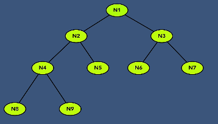
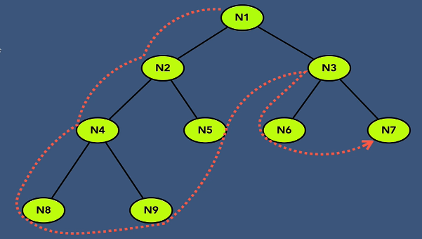
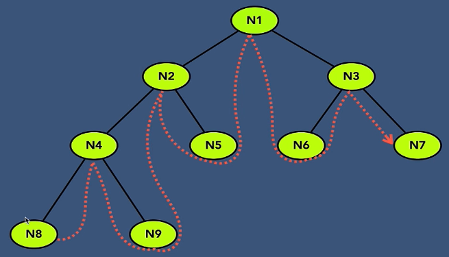
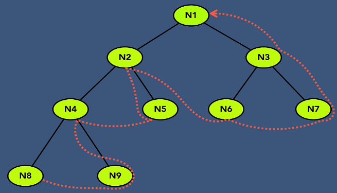
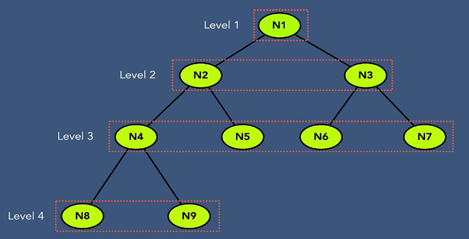
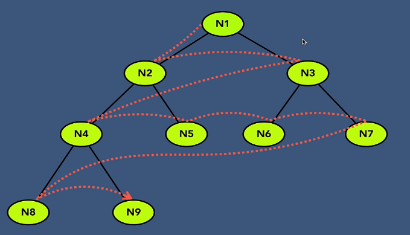

## Introduction

#### 1. Binary Tree using Linked List:
    - Traverse all nodes
    - Search for a value
    - Inserting a node
    - Creating a tree
    - Deleting a node
    - Deletion of Tree

#### 2. Binary Tree - Traversal (BinaryTreeLL.java)
    - (i). Depth First Search
        - Preorder Traversal // Root Node -> Left SubTree -> Right SubTree
        - Inorder Traversal // left-subtree node -> root node -> right-subtree node
        - Postorder Traversal // left-subtree node -> right-subtree node -> root node
    
    - (ii). Breadth First Search
        - Level order Traversal

## Traversal

#### 1. Binary Tree - PreOrder Traversal

    - Root Node -> Left SubTree -> Right SubTree

    - Traversal Sequence:

        N1 -> N2 -> N4 -> N8 -> N9 -> N5 -> N3 -> N6 -> N7

#### 2. Binary Tree - InOrder Traversal
    - left-subtree node -> root node -> right-subtree node

    - Traversal Sequence:

        N8 -> N4 -> N9 -> N2 -> N5 -> N1 -> N6 -> N3 -> N7

#### 3. Binary Tree - PostOrder Traversal
    -  left-subtree node -> right-subtree node -> root node

    - Traversal Sequence:

        N8 -> N9 -> N4 -> N5 -> N2 -> N6 -> N7 -> N3 -> N1
    

#### 4. Binary Tree - LevelOrder Traversal
    - Level wise

    - Traversal Sequence:

            N1 -> N2 -> N3 -> N4 -> N5 -> N6 -> N7 -> N8 -> N9

## Searching

#### Implements LevelOrder Traversal for searching.

        BinaryTreeLL.java --> search()